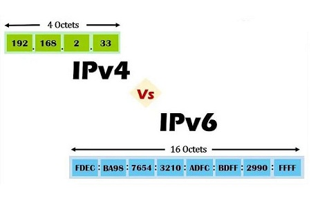
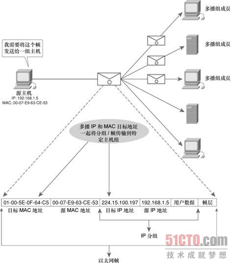

## 什么IP协议

IP协议（Internet Protocol， 互联网协议），是TCP/IP协议栈中的核心协议之一，位于TCP/IP模型中的网络层。IP协议对上接收传输层的数据报，添加IP头部之后交给下层的通信链路层包装成网络数据帧经由以太网（Ethernet）发送到目标地址。

IP协议被设计出来的目的:

```
1. 实现大规模、异构网络之间的互联互通
2. 分割顶层网络应用和底层网络技术之间的耦合关系，有利于两者的独立发展
```

IP协议为了提高适应性，简洁性和可操作性，牺牲了可靠性。所以IP协议是无连接的、数据不可靠的网络协议。

## IP协议的主要工作

#### IP地址的编址方案

#### 数据报的分片与重组

#### 数据报分组的转发

分析IP协议的头部信息就可以知道IP协议的主要工作（这里先以IPv4为例）

## IPv4 和 IPv6 

IPv4（Internet Protocol version 4） 和 IPv6（Internet Protocol version 6）是IP协议的两个版本。

> 每个网路的形成都有其历史原因，IP协议是为了将各个分散的实验室网路连接起来。由于当时的网络规模很小，所以IPv4的地址容量为40亿，尽管当时这是一个很大的数量，但是数字浪潮的来临很快带来了地址耗尽的危机，此时IPv6应运而生，它的地址空间是128位，能保证地球上每平方米上最多存在6*1023个网络地址，在可预见的未来，地址是不会耗尽的。
>
> IPv6不只是地址容量的扩充，它同时根据IPv4的经验进行了改进和优化，比如避免数据碎片化、取消checksum（校验工作由上层协议如TCP来实现）。

#### **地址格式**

<div align=left ></div>

IPv4 是点分4组8位2进制，共32位4字节。

IPv6 是冒号分8组16位2进制，共128位16字节。

#### **首部数据格式**

<div align=left style="zoom:50%"></div>


IPv4首部数据至少20字节，额外还会有40字节可选的选项字段，不识别用于QoS处理的数据包流，包含checksum、支持分片重组。

IPv6首部数据长度40字节，支持QoS处理的数据包流（Flow Label字段）、不包含checksum（由上层协议实现）、不支持分片重组。

虽然IPv6的首部数据占用空间比较大，但格式却简化了很多。

IPv4和IPv6的首部格式有很大的不同，详细的首部数据解析在后面有记载。


#### **内置的数据安全性**

IPSec 在IPv4中选择性支持的，IPSec是作为IPv4的补充协议包存在的。

IPSec 是作为IPv6本身的功能特性，不是作为补充协议包存在的。

```
IPSec（Internet Protocol Security， 互联网安全协议） 是一个协议包，是由IETF开发的一系列确保数据安全、保密传输的协议标准。
IPSec 是通过对IP协议分组数据的加密和认证来保护IP协议传输数据的协议包。
IPSec 协议工作在OSI模型的网络层，它相对于应用层协议来说足够底层，在单独使用TCP或者UDP协议时也可以保证数据的安全性。
而SSL（Secure Socket Layer， 安全套接字层协议）只能保证应用层的数据安全性。
```

关于IPSec可以参考 [百科 - IPSec](https://baike.baidu.com/item/ipsec/2472311?fr=aladdin)

IP地址的解读

IP地址是用来唯一标识一个网络设备的一串数字，例如 192.168.3.45

**格式**

点分十进制的四个部分，每部分8位，一共32位4字节。

**分类**


**组成**

网络地址 + 主机地址


IP协议的首部数据

IPv4中的子网掩码

既然有IP地址为什么还需要MAC地址

什么是校验和（checksum）

什么是QoS

DHCP

## 单播、组播、广播

单播、组播、广播是互联网中结点之间的主要通信方式。

#### 单播

一对一，IP首部中写明源IP地址和目的IP地址，以太网帧首部写明源MAC地址和目的MAC地址，数据分组从源地址发送到目标地址。

<div align=left></div>


#### 广播

广播的目标IP地址的主机部分全为1，意味着当前网络（广播域）中的所有主机都会受到并可以查看广播发送的数据分组。诸如ARP， DHCP协议都使用的广播。

A类网络 10.0.0.0 的默认子网掩码为 255.0.0.0，其广播地址为10.255.255.255

B类网络 172.16.0.0 的默认子网掩码为255.255.0.0，其广播地址为172.16.255.255

C类网络 192.168.1.0 的默认子网掩码为255.255.255.0，其广播地址为192.168.1.255

主机部分为十进制数255或二进制数11111111（全为1）

在以太网帧中，必须指明与广播的目标IP地址对应的广播目标MAC地址： FF-FF-FF-FF-FF-FF。

<div align=left></div>


#### 组播（多播）

组播是介于单播和广播之间，将数据分组发送给网络中的一组设备。

组播的目标IP地址使用的是D类IP地址，地址范围为 224.0.0.0 ~ 239.255.255.255。

组播是针对一组主机的，所以目标IP地址标识的是一组主机（也称为主机组），源IP地址是单播的IP地址，标识单一的一个主机。

与广播类似，组播的目标MAC地址也需要特殊指定，组播的MAC地址以 **01-00-5E** 开头，剩下的6位对应组播IP地址的后24个二进制位。

例:

```
组播目标IP地址： 224.15.100.197
二进制表示为：   1110 0000 . 0000 1111 . 0110 0100 . 1100 0101
16进制表示为：   B0 . 0F . 64 . C5
那么目标MAC地址 ： 01-00-5E-0F-64-C5
```

<div align=left></div>


# 参考

[百度百科 - IP协议](https://baike.baidu.com/item/IP/224599?fromtitle=IP%E5%8D%8F%E8%AE%AE&fromid=131947&fr=aladdin)

[知乎 - IP协议原理与实践](https://zhuanlan.zhihu.com/p/29287795)

[知乎 - IPV4和IPV6的区别有哪些](https://zhuanlan.zhihu.com/p/50747832)

[单播、广播和多播IP地址](https://www.cnblogs.com/therock/articles/2798653.html)

