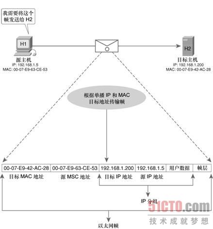
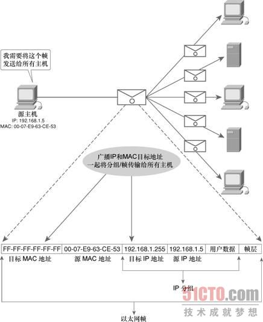
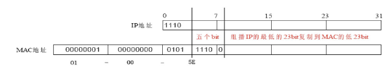
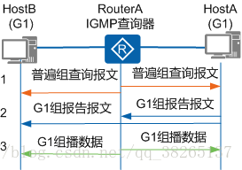
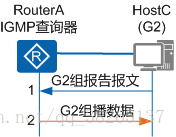
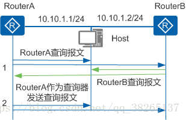
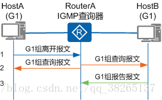

# IP组播

在介绍组播之前先简单介绍一下单播和广播，对比单播和广播对了解组播的特性有帮助。

## 单播

一对一，在发送主机和接受主机之间实现点对点连接。

单播的IP首部中写明源IP地址和目标IP地址，以太网帧首部写明源MAC地址和目标MAC地址，数据分组从源地址发送到目标地址。

<div align=left></div>


## 广播

广播的目标IP地址的主机部分全为1，意味着当前网络中的所有主机都会受到并可以查看广播发送的数据分组。诸如ARP， DHCP协议都使用的广播。

A类网络 10.0.0.0 的默认子网掩码为 255.0.0.0，其广播地址为10.255.255.255

B类网络 172.16.0.0 的默认子网掩码为255.255.0.0，其广播地址为172.16.255.255

C类网络 192.168.1.0 的默认子网掩码为255.255.255.0，其广播地址为192.168.1.255

主机部分为十进制数255或二进制数11111111（全为1）

在以太网帧中，必须指明与广播的目标IP地址对应的广播目标MAC地址： FF-FF-FF-FF-FF-FF。

<div align=left></div>

所有在子网内的主机都能收到这个数据分组，不论这些主机是否乐于接收这个数据分组。这样就会造成带宽浪费，和主机处理资源的浪费，还可能由于路由环路的问题引起广播风暴，所以广播的使用范围比较小，只在本地子网内有效。

广播风暴（broadcast storm）：

> 广播风暴也叫网络广播风暴，广播风暴(broadcast storm)故障，即一个数据包或帧被传送到本地网段(由广播域定义)上的每个节点就是广播；网络上的广播帧由于被转发，数量急剧增加而出现正常网络通信的反常现象。广播风暴会占用相当可观的网络带宽，导致正常数据包无法正常运行。当广播数据充斥网络无法处理并占用大量网络带宽，导致正常业务不能运行，这就发生了广播风暴，造成局域网局部或整个网络瘫痪。

摘自 [百度百科 - 广播风暴](https://baike.baidu.com/item/%E5%B9%BF%E6%92%AD%E9%A3%8E%E6%9A%B4/3574878?fr=aladdin)

## 组播的概述

组播是介于单播和广播之间，将数据分组发送给网络中的一组设备。

组播的目标IP地址使用的是D类IP地址，地址范围为 224.0.0.0 ~ 239.255.255.255。

组播是针对一组主机的，所以目标IP地址标识的是一组主机（也称为主机组），源IP地址是单播的IP地址，标识单一的一个主机。

<div align=left></div>

单播是点对点传输数据，如果一份数据想要发送给多台主机，源主机就需要将数据拷贝多份分别发送给这些主机，这样会导致发送方主机的负担加大、网络延迟变长，网络拥塞等问题。

使用广播的传输方式虽然可以解决上面单播的问题，但子网范围内并不是每一台主机都需要这个数据，这样就造成了带宽浪费、主机处理资源浪费，并且还有发生广播风暴故障的风险。

组播则可以解决上面的问题，它既可以将数据同时发送给多台主机，又可以指定一组目标主机，将数据发送到想要接收它的主机那里。节省了网络带宽、减少了发送方主机的压力、减少了网络拥塞、降低了接收方主机的处理负担、提高了数据传输的效率。


### 组播地址分类

组播IP地址的划分（D类IP地址）224.0.0.0 ~ 239.255.255.255

224.0.0.0 ~ 224.0.0.255 ， 用于局域网，路由器不转发数据此范围内的IP数据包。

224.0.1.0 ~ 238.255.255.255， 公网组播地址

239.0.0.0 ~ 239.255.255.255， 私网组播地址，用于限制组播范围。

224.0.0.1 ，同一网段的所有主机包括组播路由器

224.0.0.2 ，同一网段所有组播路由器

224.0.0.22，用于IGMPv3，统一网段所有组播路由器

### IP地址和MAC地址的映射

<div align=left></div>

组播的目标MAC地址和IP地址是对应的，MAC地址以 **01-00-5E** 开头，剩下的6位对应组播IP地址的后23个二进制位。

将D类IP地址映射成Ethernet MAC地址是由数据链路层完成的。在映射过程中，组播IP地址有9位不参与映射，包括前8位和紧跟在该字节后面的1个标志位共9位，其中最开始的4位1110表示是D类IP地址。剩下的23位会映射到MAC地址的后3个部分。

例：

```
组播目标IP地址： 224.15.100.197
二进制表示为：   1110 0000 . 0000 1111 . 0110 0100 . 1100 0101
后23位：000 1111 . 0110 0100 . 1100 0101，
补零之后：0000 1111 . 0110 0100 . 1100 0101
十六进制表示为：   0F . 64 . C5
那么目标MAC地址 ： 01-00-5E-0F-64-C5
```


## IGMP协议

IGMP（Internet Group Managment Protocol，网络组管理协议）用来管理组播中的组成员关系，定期维护组播组中的成员关系。IGMP 协议位于网络层，但是其报文是封装在IP报文中的。

IGMP存在三个版本 IGMPv1、IGMPv2、IGMPv3，三个版本的功能是逐步增加的。

IP组播的特点是报文从一个源发出，被转发到一组特定的接收者。发送端不需要知道这些主机的位置信息，只是将数据发送到约定的一个组播组的地址。要使组播报文数据能发送到一组接受者那里，需要使连接一个网段的组播路由器了解到这个网段中存在哪些组播接收者，同时保证接收者可以加入到一个组中。IGMP就是用来在接收者与其所在网段中直接相连的组播路由器之间建立、维护组播成员关系的协议。

### IGMPv1

#### IGMPv1的报文类型

· 普遍组查询报文（General Query）：查询器向共享网络上的所有主机和路由器发送的报文，用于了解哪些组播组存在成员

· 组成员报告报文（Report）：主机向查询器发送的报文，用于加入某个组播组或者响应查询器发送的查询报文。

#### IGMPv1工作机制

IGMPv1 基于查询和响应机制完成组播组的管理工作（发送查询报文、接收报告报文）。

一个网段中可以有多个组播路由器，它们都可以接受主机报告报文，因此只需要其中一台组播路由器发送查询报文就足够了，这个组播路由器称为IGMP查询器（Querier）。

**在IGMPv1中，由组播路由协议PIM选举出唯一的组播信息转发者**（Assert Winner或DR）作为IGMPv1的查询器，负责该网段的组成员关系查询。

三个主要的工作机制：普遍组查询和响应机制、组成员加入机制、组成员离开机制。

##### 查询和响应机制

<div align=left></div>

1. IGMP查询器发送目的地址为 224.0.0.1（标识同一网段内的所有主机和路由器）、组播地址为 0.0.0.0 的普遍组查询报文，收到该查询报文的组成员启动定时器。

   查询器会周期性地发出普遍组查询报文，默认是60秒，可以动过命令设置。HostA和HostB是组播组G1的成员，他们收到查询报文之后会启动各自的定时器，默认情况下是10秒超时。

2. 这里是HostA的定时器 Timer-A 先超时，它会先成员报告报文（目的地址是组播组的地址），发出的报告报文HostB也会收到，那么HostB 会停止定时器Timer-B，不会再针对G1发送报告报文。这个中报告报文的抑制机制可以减少网段上的流量。

3. 查询器收到HostA的报告报文后，了解到本网段中存在组播组G1的成员，那么由组播路由协议（PIM）生成（**，G1）的组播转发表项，* 星号代表任意的组播源。网络中一旦有针对组播组G1的报文到达路由器，路由器就会将这个报文转发给所有组播成员。


##### 成员的加入机制

<div align=left></div>

1. HostC 不用等待查询器针对G2的查询报文，自己主动发出报告报文，声明要加入G2。
2. 查询器收到HostC发送过来的G2报告报文，了解到该网段中出现了组播组G2的成员，然后生成了（*，G2）的转发项。
3. 网络中一旦有G2的数据包到达组播路由器，该数据包都会被转发到组播组中的所有成员那里。

##### 组成员的离开机制

如果HostA要离开G1

当收到查询器的普遍组查询报文时，HostA不会再发送报告报文了。而HostB并没有离开G1，所以HostB会发送报告报文。查询器此时只收到了HostB的报告报文，而感知不到HostA的离开。

如果HostC要离开G2

当HostC收到查询器的查询报文时，不在发送针对G2的报告报文。因为网段中除了HostC以外没有别的G2组成员了，查询器并没有收到HostC的G2报告报文，那么在过了一定时间之后（默认是130秒）会删除掉G2所对应的组播转发项。


### IGMPv2

相对于IGMPv1，IGMPv2增加了组播成员离开机制，其他功能与IGMPv1基本一致。

组成员要离开组播组时会主动发出离开报文通知IGMP查询器，IGMP查询器收到离开报文之后会连续发送特定组查询报文，询问这个组中是否还有成员，如果在一段时间之后还是没有收到组成员的报告报文，那么查询器不会在维护这个组的成员关系。

IGMPv2通过组成员离开报文和特定组查询报文可以及时了解到网段中哪些组播组已经不存在成员，从而及时更新成员关系，减少网络中的冗余流量。

#### IGMPv2新增的两种报文

· 成员离开报文（Leave）：成员离开组播组时主动向查询器发送离开报文，宣告自己离开了某个组播组。

· 特定组查询报文（Group-Specific Query）：查询器在收到组成员的离开报文后，会定期向网段内发送的报文，用来及时查询该组是否还有成员。

#### IGMPv2的工作机制

与IGMPv1相比，IGMPv2增加了查询器的选举机制和组成员离开机制。

##### 查询器选举机制

IGMPv2使用独立的查询器选举机制，当网段中存在多个组播路由器时，会根据一定的规则决定哪一个为IGMP的查询器。通常使用的规则是 IP 地址最小的路由器作为IGMP的查询器。

<div align=left></div>

1. 所有运行了IGMPv2的组播路由器（RouterA和RouterB）都认为自己是IGMP查询器，他们都会向本网段中发送普遍组查询报文。
2. RouterA和RouterB在收到了对方的查询报文之后，会拿对方的IP地址和自己的IP地址进行比较，这里RouterB发现自己的IP地址比较大，那么自己将不会被选举为查询器
3. RouterA在称为组播查询器之后，会向本网段中发送普遍组查询报文，而非查询器路由器将不会发送普遍组查询报文。非查询器路由器上都会默认启动一个定时器，在定时器超时之前收到了来自查询器的查询报文则重置定时器，如果定时器超时则认为当前的查询器失效，并发起新一轮的查询器选举过程。

##### 组成员离开机制

<div align=left></div>

1. HostA要离开组G1，它会向网段中所有的组播路由器（目的地址为224.0.0.2）发送G1的组离开报文。

2. IGMP查询器收到HostA的G1离开报文之后，会多次发送针对G1的特定组查询报文，发送间隔和次数可以通过命令设置，默认情况下每隔1秒发送一次，共发送2次。

3. 同时查询器会启动成员关系定时器（Timer-Membership）

4. 如果该网段内G1组还存在成员，那么这些成员会发送G1的报告报文，查询器在收到报告报文后还会继续维护G1组的成员关系。

   如果G1不存在成员了，那么查询器就不会收到G1的报告报文，在Timer-Membership超时之后，查询器不会继续维护G1的成员关系，（*，G1）转发项将会被删除，所有G1的报文将不会被转发。


### IGMPv3

IGMPv3相比于前两个版本，提供了在报文中携带组播源信息的能力，即接收端主机可以针对组播源进行过滤，选择性接收组播报文。

#### IGMPv3工作机制

##### 组播源的选择机制

IGMPv3的成员报告报文的目的地址为224.0.0.22（表示同一网段所有使能IGMPv3的路由器）。通过在报告报文中携带组记录，主机在加入组播组的同时，能够明确要求接收或不接收特定组播源发出的组播数据。

如果Host和组播路由器之间运行的是IGMPv1或IGMPv2，Host加入组播组G时无法对组播源进行选择，无论其是否需要，都会同时接收到来自组播源S1和S2的数据。如果采用IGMPv3，成员主机可以选择仅接收S1组播数据。

方法一：Host发送IGMPv3报告（G，INCLUDE，(S1)），仅接收源S1向组播组G发送的数据。
方法二：Host发送IGMPv3报告（G，EXCLUDE，(S2)），不接收指定源S2向组播组G发送的数据，从而仅有来自S1的组播数据才能传递到Host。

##### 特定组源查询

当接收到组成员发送的改变组播组与源列表的对应关系的报告时（比如CHANGE_TO_INCLUDE_MODE、CHANGE_TO_EXCLUDE_MODE），IGMP查询器会发送特定源组查询报文。如果组成员希望接收其中任意一个源的组播数据，将反馈报告报文。IGMP查询器根据反馈的组成员报告更新该组对应的源列表。

## PIM协议

在组播体系中，IGMP协议用来维护组播组和组的成员关系。而组播数据的路由转发工作则交给PIM协议来完成（Protocol Indepentent Muticast，协议无关组播）

PIM分为PIM-DM（稠密型）和PIM-SM（稀疏型），PIM-DM多用于局域网络，因为组成员分布比较密集。PIM-SM多用于广域网，组成员多分布于多个网段中。

当组播数据到达组播路由器时，路由器通过PIM建立的组播转发项来知道路由器如何转发报文数据。

PIM 会维护一个组播转发树来转发组播数据，组播源的数据首先会到达根节点，数据会经过树的某一路径到达组播成员（叶子节点）。

当网段中某一主机想要加入某一个组播组中时，它的报告报文会经过若干个网络节点到达根节点，这时PIM会记录下这个路径然后添加到组播转发树中，等下次要发送报文的时候，会使用这个路径。

PIM 的概念还有很多，这里只是根据个人理解进行简要阐述。

## 参考

[CSDN - 曹世宏的博客 - IGMP基础](https://blog.csdn.net/qq_38265137/article/details/80475475)

[IGMP协议总结](https://www.sohu.com/a/290713920_639793)

[单播、广播和多播IP地址](https://www.sohu.com/a/290713920_639793)

[IP组播原理](https://www.docin.com/p-1811646795.html)

[CSDN - 协议无关组播-PIM](https://blog.csdn.net/qq_38265137/article/details/80475542)

[知乎 - 组播路由协议PIM](https://zhuanlan.zhihu.com/p/58231764)

[CSDN - PIM协议概述](https://blog.csdn.net/KI0323/article/details/82386119)

