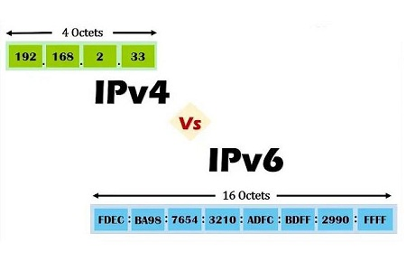
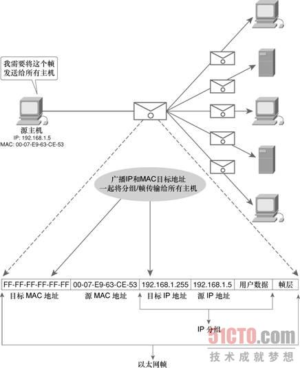
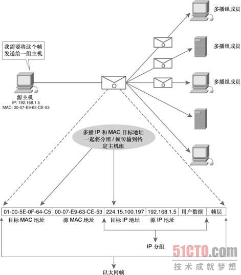

## 什么IP协议

IP协议（Internet Protocol， 互联网协议），是TCP/IP协议栈中的核心协议之一，位于TCP/IP模型中的网络层。IP协议对上接收传输层的数据报，添加IP头部之后交给下层的通信链路层包装成网络数据帧经由以太网（Ethernet）发送到目标地址。

IP协议被设计出来的目的:

```
1. 实现大规模、异构网络之间的互联互通
2. 分割顶层网络应用和底层网络技术之间的耦合关系，有利于两者的独立发展
```

IP协议为了提高适应性，简洁性和可操作性，牺牲了可靠性。所以IP协议是无连接的、数据不可靠的网络协议。

## IP协议的主要工作

#### IP地址的编址方案

#### 数据报的分片与重组

#### 数据报分组的转发

分析IP协议的头部信息就可以知道IP协议的主要工作（这里先以IPv4为例）

## IPv4 和 IPv6 

IPv4（Internet Protocol version 4） 和 IPv6（Internet Protocol version 6）是IP协议的两个版本。

> 每个网路的形成都有其历史原因，IP协议是为了将各个分散的实验室网路连接起来。由于当时的网络规模很小，所以IPv4的地址容量为40亿，尽管当时这是一个很大的数量，但是数字浪潮的来临很快带来了地址耗尽的危机，此时IPv6应运而生，它的地址空间是128位，能保证地球上每平方米上最多存在6*1023个网络地址，在可预见的未来，地址是不会耗尽的。
>
> IPv6不只是地址容量的扩充，它同时根据IPv4的经验进行了改进和优化，比如避免数据碎片化、取消checksum（校验工作由上层协议如TCP来实现）。

#### **地址格式**

<div align=left ></div>

IPv4 是点分4组8位2进制，共32位4字节。

IPv6 是冒号分8组16位2进制，共128位16字节。

#### **首部数据格式**

<div align=left style="zoom:50%"></div>


IPv4首部数据至少20字节，额外还会有40字节可选的选项字段，不识别用于QoS处理的数据包流，包含checksum、支持分片重组。

IPv6首部数据长度40字节，支持QoS处理的数据包流（Flow Label字段）、不包含checksum（由上层协议实现）、不支持分片重组。

虽然IPv6的首部数据占用空间比较大，但格式却简化了很多。

IPv4和IPv6的首部格式有很大的不同，详细的首部数据解析在后面有记载。


#### **内置的数据安全性**

IPSec 在IPv4中选择性支持的，IPSec是作为IPv4的补充协议包存在的。

IPSec 是作为IPv6本身的功能特性，不是作为补充协议包存在的。

```
IPSec（Internet Protocol Security， 互联网安全协议） 是一个协议包，是由IETF开发的一系列确保数据安全、保密传输的协议标准。
IPSec 是通过对IP协议分组数据的加密和认证来保护IP协议传输数据的协议包。
IPSec 协议工作在OSI模型的网络层，它相对于应用层协议来说足够底层，在单独使用TCP或者UDP协议时也可以保证数据的安全性。
而SSL（Secure Socket Layer， 安全套接字层协议）只能保证应用层的数据安全性。
```

关于IPSec可以参考 [百科 - IPSec](https://baike.baidu.com/item/ipsec/2472311?fr=aladdin)

IP地址的解读

IP地址是用来唯一标识一个网络设备的一串数字，例如 192.168.3.45

**格式**

点分十进制的四个部分，每部分8位，一共32位4字节。

**分类**


**组成**

网络地址 + 主机地址

IP协议的首部数据

IPv4中的子网掩码

既然有IP地址为什么还需要MAC地址

什么是校验和（checksum）

什么是QoS

DHCP

## 单播、组播、广播

单播、组播、广播是互联网中结点之间的主要通信方式。

#### 单播

一对一，在发送主机和接受主机之间实现点对点连接。

单播的IP首部中写明源IP地址和目标IP地址，以太网帧首部写明源MAC地址和目标MAC地址，数据分组从源地址发送到目标地址。

<div align=left></div>


#### 广播

广播的目标IP地址的主机部分全为1，意味着当前网络（广播域）中的所有主机都会受到并可以查看广播发送的数据分组。诸如ARP， DHCP协议都使用的广播。

A类网络 10.0.0.0 的默认子网掩码为 255.0.0.0，其广播地址为10.255.255.255

B类网络 172.16.0.0 的默认子网掩码为255.255.0.0，其广播地址为172.16.255.255

C类网络 192.168.1.0 的默认子网掩码为255.255.255.0，其广播地址为192.168.1.255

主机部分为十进制数255或二进制数11111111（全为1）

在以太网帧中，必须指明与广播的目标IP地址对应的广播目标MAC地址： FF-FF-FF-FF-FF-FF。

<div align=left></div>

所有在子网内的主机都能收到这个数据分组，不论这些主机是否乐于接收这个数据分组。这样就会造成带宽浪费，和主机处理资源的浪费，还可能由于路由环路的问题引起广播风暴，所以广播的使用范围比较小，只在本地子网内有效。

广播风暴（broadcast storm）：

> 广播风暴也叫网络广播风暴，广播风暴(broadcast storm)故障，即一个数据包或帧被传送到本地网段(由广播域定义)上的每个节点就是广播；网络上的广播帧由于被转发，数量急剧增加而出现正常网络通信的反常现象。广播风暴会占用相当可观的网络带宽，导致正常数据包无法正常运行。当广播数据充斥网络无法处理并占用大量网络带宽，导致正常业务不能运行，这就发生了广播风暴，造成局域网局部或整个网络瘫痪。

摘自 [百度百科 - 广播风暴](https://baike.baidu.com/item/%E5%B9%BF%E6%92%AD%E9%A3%8E%E6%9A%B4/3574878?fr=aladdin)


#### 组播（多播）

组播是介于单播和广播之间，将数据分组发送给网络中的一组设备。

组播的目标IP地址使用的是D类IP地址，地址范围为 224.0.0.0 ~ 239.255.255.255。

组播是针对一组主机的，所以目标IP地址标识的是一组主机（也称为主机组），源IP地址是单播的IP地址，标识单一的一个主机。

<div align=left></div>


## 组播原理的概述

#### 组播的优势

单播是点对点传输数据，如果一份数据想要发送给多台主机，源主机就需要将数据拷贝多份分别发送给这些主机，这样会导致发送方主机的负担加大、网络延迟变长，网络拥塞等问题。

使用广播的传输方式虽然可以解决上面单播的问题，但子网范围内并不是每一台主机都需要这个数据，这样就造成了带宽浪费、主机处理资源浪费，并且还有发生广播风暴故障的风险。

组播则可以解决上面的问题，它既可以将数据同时发送给多台主机，又可以指定一组目标主机，将数据发送到想要接收它的主机那里。节省了网络带宽、减少了发送方主机的压力、减少了网络拥塞、降低了接收方主机的处理负担、提高了数据传输的效率。

#### 组播的特点

IP组播是将数据包“尽最大努力”传输到一个构成组播群组的主机集合中，群组的各个成员可以分布于各个独立的网络中。

IP组播的群组成员是动态的，主机可以随时加入或退出群组。群组的成员关系决定了成员主机是否接收发送到这个群组中的数据包，非群组成员也可以发送数据包到这个群组中。

#### 地址分类

组播IP地址的划分（D类IP地址）

1. 局部链接地址

224.0.0.0 ~ 224.0.0.255 ， 用于局域网，路由器不转发数据此范围内的IP数据包。

2. 预留组播地址

224.0.1.0 ~ 238.255.255.255， 用于全球范围或网络协议

3. 管理权限地址

239.0.0.0 ~ 239.255.255.255， 组织内部使用，用于限制组播范围。

#### IP地址和MAC地址的映射

组播的目标MAC地址和IP地址是对应的，MAC地址以 **01-00-5E** 开头，剩下的6位对应组播IP地址的后23个二进制位。

将D类IP地址映射成Ethernet MAC地址是由数据链路层完成的。在映射过程中，组播IP地址有9位不参与映射，包括前8位和紧跟在该字节后面的1个标志位共9位，其中最开始的4位1110表示是D类IP地址。剩下的23位会映射到MAC地址的后3个部分。

例：

```
组播目标IP地址： 224.15.100.197
二进制表示为：   1110 0000 . 0000 1111 . 0110 0100 . 1100 0101
后23位：000 1111 . 0110 0100 . 1100 0101，
补零之后：0000 1111 . 0110 0100 . 1100 0101
十六进制表示为：   0F . 64 . C5
那么目标MAC地址 ： 01-00-5E-0F-64-C5
```

#### IGMP协议概述

IGMP（Internet Group Managment Protocol，互网络组管理协议）


# 参考

[百度百科 - IP协议](https://baike.baidu.com/item/IP/224599?fromtitle=IP%E5%8D%8F%E8%AE%AE&fromid=131947&fr=aladdin)

[知乎 - IP协议原理与实践](https://zhuanlan.zhihu.com/p/29287795)

[知乎 - IPV4和IPV6的区别有哪些](https://zhuanlan.zhihu.com/p/50747832)

[单播、广播和多播IP地址](https://www.cnblogs.com/therock/articles/2798653.html)

[IP组播原理](https://www.docin.com/p-1811646795.html)