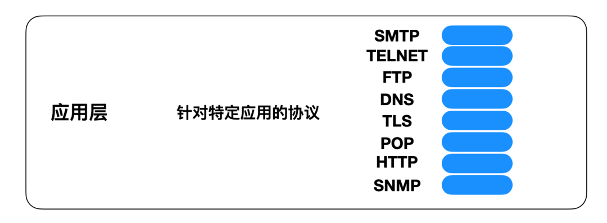
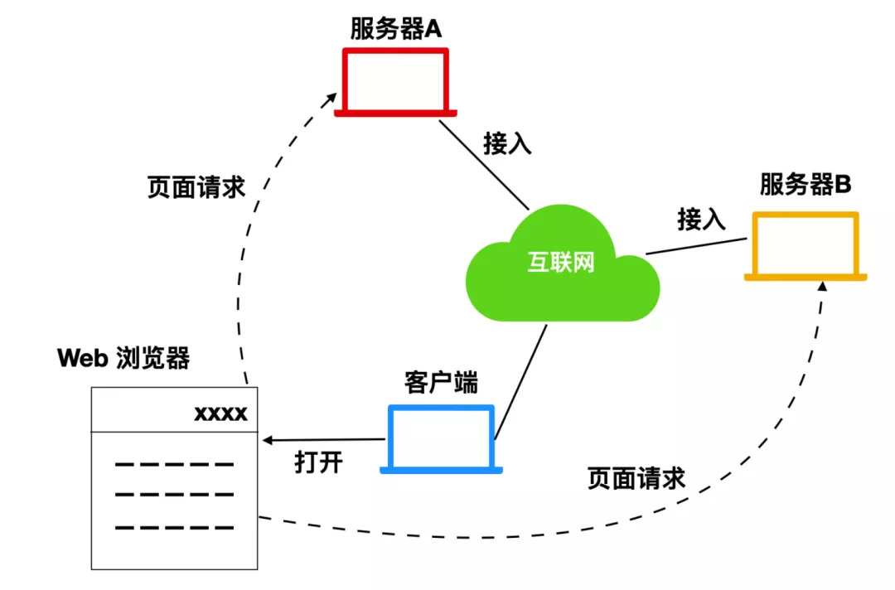

[ 24 张图剖析计网应用层协议](https://mp.weixin.qq.com/s?__biz=MzI0ODk2NDIyMQ==&mid=2247486507&idx=1&sn=622cc363b34bce54f4953076faa1cad6&chksm=e999f939deee702f2444df83ad9805de8c70fb88b89d299fdf0a82b3463e253f32372963c039&token=1664520392&lang=zh_CN#rd)

OSI标准模型（自上而下）：

应用层、表示层、会话层、传输层、网络层、数据链路层、物理层

## 应用层概念

#### 应用层协议：

针对特定的应用，有不同的应用层协议来进行网络数据通信

应用层协议定义在不同端系统上如何传递报文，定义的标准有下面几点：

1. 报文的类型：请求还是响应

2. 报文字段的解释：对报文中各个字段的描述

3. 报文字段的语义：报文的各个字段都是什么含义

4. 进程在何时、以什么方式发送和响应

#### 应用层体系结构（Application Architecture）：

两种主流的体系结构：

1. 客户端-服务器体系（client-server architecture）

2. 对等体系机构（P2P architecture）

> 客户端-服务器模式下，客户端之间彼此是不通信的。
>
> 服务器通常具有固定的、周知的IP地址供客户端访问

客户端-服务器模式中，服务器是数据的存储和交互中心。服务器针对每一个客户端的访问开辟一个进程来处理它和这个客户端之间的数据通信。在这种模式下通常会出现随着客户数量的急剧增加，单台服务器无法完成大量客户端请求的情况。因此要需要配置大量主机的**数据中心（data center）**来跟踪所有用户的请求。

P2P模式却相反，它是去中心化的模式。每个客户端在这个体系模型中称为一个结点，每个节点既是数据的请求这也是数据的提供者。P2P体系结构最大的特点是高度的**扩展性（self-scalablity）**，因为P2P网络的一个重要的目标，就是希望

### 进程通信

计算机上允许多个程序同时运行，每一个程序都是一个进程，他们之间会共享操作系统的某一段空间。

进程之间若想通信是需要一定的规则的，而这个规则是由操作系统确定的。

#### 进程与计算机网络之间的接口

计算机网络中的多个端系统的进程进行通信，使用的是套接字（Socket）。

Socket是一个软件编程接口，开发人员可以编写和改变其中的细节，然是不能干涉信息的传输。

Socket属于主机或服务进程的内部接口，应有程序开发人员进行控制。两台端系统间进行通信时，发送端Socket将数据放入TCP缓冲区，

然后将数据通过网络传输到另一个端系统的TCP缓冲区中，Socket再从TCP缓冲区中取到报文共应用进程使用。

#### 进程寻址

IP地址标识一个端系统，端口号（port）标识端系统内的某一个进程。

#### 传输服务的选择

应用程序属于互联网四层协议的应用层协议，根据应用程序的用途会选择不同的应用层协议来发送报文。

好比去一个地方要使用的交通工具。

选择的主要标准：

1. **数据传输是否可靠**

   数据的传输时候可以完整、按照发送时的时序到达接收端。

2. **吞吐量**

   单位时间内从发送端到接收端发送数据的比特数量。

   对吞吐量有要求的程序成为 带宽敏感应用（Bandwidth-sensitive application）

   格局当时的带宽调整吞吐量的应用成为 弹性应用（elastic appliction）

3. **定时性和安全性**

   定时性确保数据能否在指定时间内传输完成。

   安全性确保运输协议能否提供一种或者多种安全性服务

#### TCP 和 UDP

TCP：

TCP是最常用的传输层协议，它主要具有以下特性：

1. **面向连接的服务**

   当客户端和服务端之间要进行数据通信时，TCP会交换两端的运输层控制信息，这是一个多次的握手过程。

   这个握手过程确保了两端都知道了对方的存在，各自准备好要交换和传输的数据。

   当这个过程完成之后，客户端和服务端就建立起了一个TCP连接，这个连接是全双工的，

   即连接双方的进程在此连接上可以同时进行报文的接收和发送。当报文发送完毕，必须断开连接以释放资源。

2. **数据传输可靠**

   通信的进程依靠TCP，可以无差错、按适当的顺序、完整无丢失、没有冗余地将数据发送给对方的套接字。

3. **拥塞控制**

   拥塞控制并不一定会为两端通信带来好处，但是可以对网络整体带来好处。当接收和发送放之间出现网络拥塞时。

   TCP会抑制发送方（客户端或服务端）的数据发送。

UDP

相比于TCP，UDP就显得简单和轻量级了许多。它提供最小的服务，是无连接的，不能保证传输数据的完整性，时序性。

它将数据发送到网络中之后就不管了，更不会保证数据是否传输到了服务端。

## 应用层

万维网（World Wide Web - WWW）

1. URI

   Uniform Resource Identifier统一资源标识，包含URL（Uniform Resource Location 统一资源路径）和URN（Uniform Resource Name统一资源名称）

   用来唯一标识互联网中的资源数据

2. HTML

   超文本标记语言，是一种脚本语言，以Web浏览器作为容器显示互联网资源。包括文本、图片、视频、音频等。

3. HTTP

   超文本传输协议（HyperText Transfer Protocol）定义了数据发送的规范。

4. 

